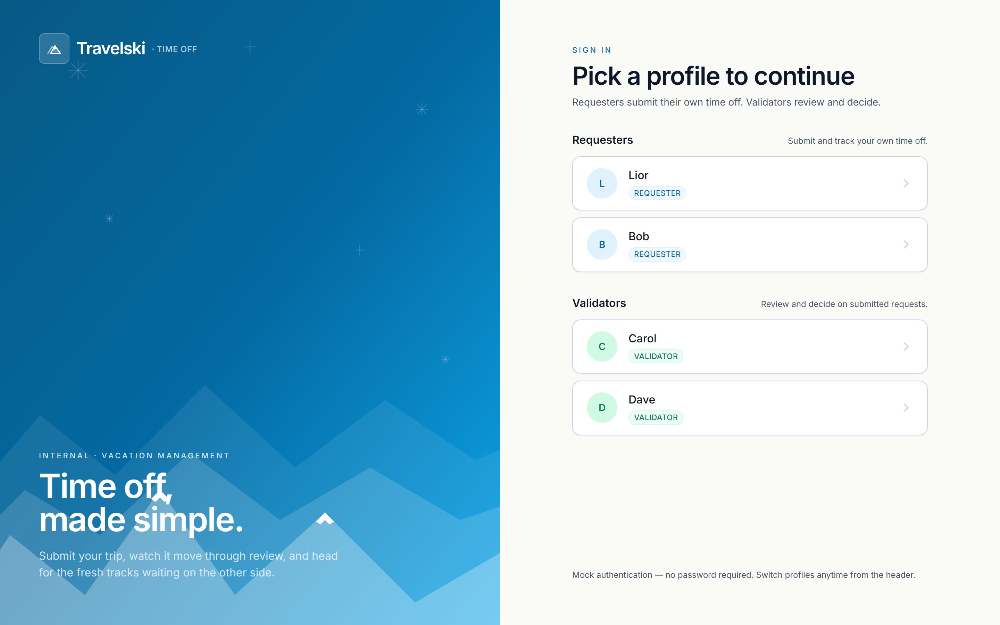
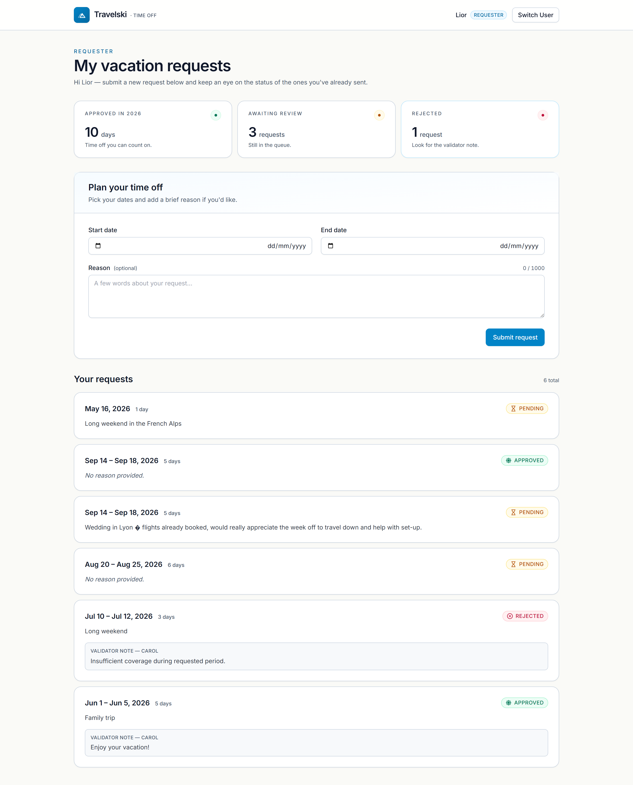
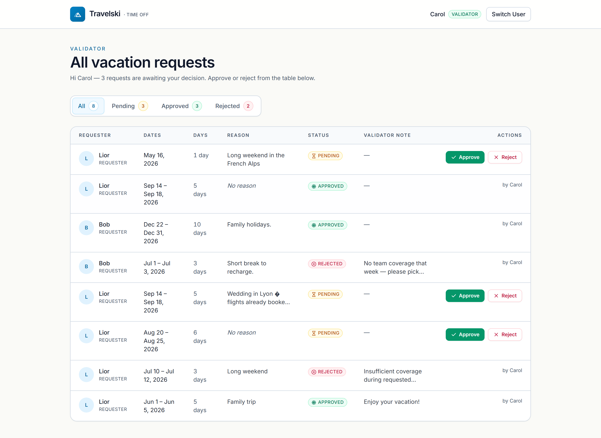

# Vacation Management

Internal vacation request system for Travelski employees — Requesters submit time off, Validators approve or reject.



## Tech Stack

| Layer | Technology |
| --- | --- |
| Backend runtime | Node.js 24.15.0 |
| Backend language | TypeScript 6.0.3 |
| HTTP framework | Express 4.21.1 |
| ORM | TypeORM 0.3.29 (with `typeorm-naming-strategies` 4.1.0) |
| Database driver | pg 8.20.0 |
| Validation | class-validator 0.15.1 + class-transformer 0.5.1 |
| Backend dev runtime | ts-node-dev 2.0.0 |
| Backend tests | Jest 30.4.2 + Supertest 7.2.2 + ts-jest 29.4.9 |
| Frontend framework | Vue 3.5.34 |
| Frontend language | TypeScript 6.0.2 |
| Build tool | Vite 8.0.12 |
| Styling | Tailwind CSS 3.4.19 + PostCSS 8.5.14 + Autoprefixer 10.5.0 |
| State management | Pinia 3.0.4 |
| Routing | Vue Router 4.6.4 |
| HTTP client | Axios 1.16.1 |
| Frontend tests | Vitest 3.2.4 + @vue/test-utils 2.4.6 + @pinia/testing 1.0.2 + jsdom 25.0.1 |
| Type-check | vue-tsc 3.2.8 |
| Database | PostgreSQL 16 (alpine image) |
| Orchestration | Docker Compose (single `postgres` service) |
| Monorepo dev | concurrently 9.1.0 |

## Prerequisites

- **Node.js v24.15.0** (any 24.x should work)
- **Docker** + **Docker Compose v2**
- **npm** (ships with Node)

## Quick Start

```bash
git clone <repo-url>
cd vacation-management

# 1. Environment files (the .env.test for the backend is already committed)
cp .env.example .env
cp backend/.env.example backend/.env

# 2. Install all workspaces (root + backend + frontend)
npm run install:all

# 3. Start PostgreSQL (port 5433 on the host, 5432 inside the container).
#    --wait blocks until the healthcheck reports healthy, so the next step
#    never races against container start-up.
docker compose up -d --wait

# 4. Create the separate test database (used by the backend integration suite)
docker exec -i vacation-management-postgres createdb -U postgres vacation_management_test

# 5. Run migrations + seed the four mock users into the main database
npm run migration:run --prefix backend
npm run seed --prefix backend

# 6. Start backend and frontend concurrently
npm run dev
```

Open <http://localhost:5173> and pick a profile.

> Postgres is mapped to host port **5433** (not the default 5432) to avoid conflicting with a native Postgres install. This is reflected in `backend/.env.example`.

## Available Scripts

### Root (`/`)

| Script | What it does |
| --- | --- |
| `npm run install:all` | Installs root, backend, and frontend dependencies in one shot |
| `npm run dev` | Runs backend (port 3000) and frontend (port 5173) concurrently |

### Backend (`/backend`)

| Script | What it does |
| --- | --- |
| `npm run dev` | Starts the API with `ts-node-dev` (auto-reload) |
| `npm run build` | Compiles TypeScript to `dist/` |
| `npm run start` | Runs the compiled build from `dist/` |
| `npm run typeorm` | Generic TypeORM CLI passthrough |
| `npm run migration:run` | Applies pending migrations |
| `npm run migration:revert` | Reverts the last migration |
| `npm run migration:generate` | Generates a new migration from entity diff |
| `npm run seed` | Seeds the four mock users (idempotent: skips if users exist) |
| `npm test` | Runs the Jest + Supertest integration suite (`--runInBand`) |

### Frontend (`/frontend`)

| Script | What it does |
| --- | --- |
| `npm run dev` | Starts Vite dev server on port 5173 |
| `npm run build` | Type-checks with `vue-tsc` then builds for production |
| `npm run preview` | Serves the production build locally |
| `npm test` | Runs the Vitest unit suite (`vitest run`) |

## Project Structure

```
vacation-management/
├── backend/
│   ├── src/
│   │   ├── controllers/     # Users + vacation-requests handlers
│   │   ├── dtos/            # class-validator DTOs (create, approve, reject)
│   │   ├── entities/        # User, VacationRequest
│   │   ├── middleware/      # current-user, error-handler, require-role
│   │   ├── migrations/      # TypeORM SQL migrations
│   │   ├── routes/          # Express routers
│   │   ├── seeds/           # seed-users.ts (CLI + reusable function)
│   │   ├── types/           # express.d.ts (Request augmentation)
│   │   ├── utils/           # AppError class, validation helper
│   │   ├── app.ts           # Express app factory (no listen)
│   │   ├── data-source.ts   # TypeORM DataSource
│   │   └── index.ts         # Entry point (listens)
│   ├── tests/               # Jest integration tests (users, vacation-requests)
│   ├── .env.example
│   └── .env.test            # Committed; points at vacation_management_test
├── frontend/
│   ├── src/
│   │   ├── components/
│   │   │   ├── layout/      # AppHeader, AppLayout
│   │   │   ├── requester/   # RequestForm, MyRequestsList
│   │   │   ├── validator/   # RequestsTable, StatusFilter, RejectDialog
│   │   │   └── shared/      # BrandMark, StatStrip, StatusBadge, ToastContainer
│   │   ├── router/          # Vue Router with role-guarded routes
│   │   ├── services/        # api.ts (Axios instance + endpoint helpers)
│   │   ├── stores/          # user, toast (Pinia)
│   │   ├── types/           # Shared TypeScript types
│   │   ├── views/           # UserPickerView, RequesterView, ValidatorView
│   │   ├── App.vue
│   │   ├── main.ts
│   │   └── style.css
│   ├── tests/               # Vitest specs (stores + components)
│   ├── index.html
│   └── tailwind.config.js
├── docs/screenshots/        # PNGs referenced in this README
├── docker-compose.yml       # Postgres 16 on host port 5433
├── .env.example
└── package.json             # Root: concurrently + install:all + dev
```

## Architecture Overview

A two-workspace monorepo. The backend is an Express + TypeORM service against PostgreSQL, exposing a small REST API (`/api/users`, `/api/vacation-requests`, `/api/vacation-requests/:id/approve`, `/api/vacation-requests/:id/reject`). The frontend is a Vue 3 SPA with Pinia for state, Vue Router for navigation, and Axios for transport. Authentication is mocked via a single `X-User-Id` HTTP header — the frontend stores the picked user in `localStorage` and an Axios request interceptor attaches the header on every request; a backend middleware resolves the user and attaches it to the Express `Request`. The API returns a uniform JSON error shape (`{ error: { message, details? } }`), validation errors carry `details`, and all DB-level concerns (snake_case columns, transactional writes, role guards) live behind controllers.

## Mock Authentication

There are four seeded users:

| Name  | Role      |
| ----- | --------- |
| Lior  | Requester |
| Bob   | Requester |
| Carol | Validator |
| Dave  | Validator |

On first load the app shows a profile picker. The picked user is saved to `localStorage`; an Axios interceptor adds an `X-User-Id` header to every outbound request; the backend `currentUser` middleware loads that user from the database and attaches it to `req.user`; the `requireRole` middleware then enforces role-specific endpoints.

**This is not production-secure.** Any client can impersonate any user by changing the header. The mock is isolated to a single middleware so a real auth system can replace it without touching controllers.

## Technical Decisions

- **Custom Tailwind components instead of Inspinia.** The brief suggested Inspinia, but it's a Bootstrap-era admin kit from the mid-2010s. A modern Tailwind approach lets every component be designed intentionally rather than fighting a theme's defaults, and serves the brief's Creativity criterion.
- **Monorepo with sibling `backend/` and `frontend/`.** A root `package.json` with `concurrently` gives one clone, one README, one command to start everything.
- **TypeScript on both sides.** TypeORM is TS-first (decorators); TypeScript on the frontend catches API boundary mistakes; both compile down to ES2022 JavaScript at runtime, satisfying the brief's ES6+ requirement.
- **Mock auth via `X-User-Id` header.** The spec does not require real authentication; building it would consume time without serving any specified requirement. Confined to one middleware so it can be swapped for real auth later.
- **Separate approve / reject endpoints (`PATCH /:id/approve`, `PATCH /:id/reject`).** Different validation rules apply — reject requires a comment, approve does not. Two endpoints keep intent clear in code and in API logs.
- **Postgres mapped to host port 5433.** Avoids conflict with a native Postgres install (common on Windows). Documented in `backend/.env.example`, so any future developer can `docker compose up -d` without uninstalling their host Postgres.
- **Standard JSON error shape: `{ error: { message, details? } }`.** Validation errors carry a `details` array of field-level messages; other errors only carry `message`.
- **`SnakeNamingStrategy` from `typeorm-naming-strategies`.** Entity properties stay camelCase in TypeScript; columns are snake_case in PostgreSQL.
- **`DATE` columns (not `TIMESTAMP`) for vacation periods.** A vacation runs Monday to Friday, not 09:13 to 17:47.
- **TypeScript 6 with modern compiler options.** `tsconfig.base.json` is shared across both workspaces; each workspace extends it.

## Design Inspiration

A cool alpine-blue primary (`#0284c7`) over warm off-white surfaces (`#FAFAF7`) and slate-cool tints. Status colors are warm amber for Pending, fresh emerald for Approved, and a soft rose for Rejected. Subtle alpine motifs appear throughout: a snowflake on the Approved badge, a stylized mountain mark in the BrandMark, Fraunces serif for display headings paired with Inter for body. A deliberate, restrained nod to Travelski's brand world without turning an internal admin tool into a consumer booking site.

## Testing

### Backend — Jest + Supertest

Integration tests run against a **separate test database** (`vacation_management_test`) so they never touch development data. The test setup runs migrations and seeds users in `beforeAll`, and truncates `vacation_requests` between tests.

**One-time setup** (the `vacation_management_test` database must exist on the running Postgres container):

```bash
docker exec -i vacation-management-postgres createdb -U postgres vacation_management_test
```

**Run the suite:**

```bash
npm test --prefix backend
```

Current count: **14 tests, 2 suites** (`users.test.ts`, `vacation-requests.test.ts`), ~2.3s.

### Frontend — Vitest + @vue/test-utils

Unit-level coverage for Pinia stores and the most logic-bearing components. Uses `@pinia/testing` for store isolation and `jsdom` for DOM stubs.

```bash
npm test --prefix frontend
```

Current count: **19 tests, 6 suites**, ~1.4s. Coverage:

- `stores/user.spec.ts` — login/logout, localStorage persistence
- `stores/toast.spec.ts` — push, auto-dismiss, manual dismiss
- `components/requester/RequestForm.spec.ts` — past-date and date-order validation; valid-payload submission with reason trimming
- `components/shared/StatusBadge.spec.ts` — variant rendering for each status
- `components/validator/RejectDialog.spec.ts` — comment-required confirm gate
- `components/validator/StatusFilter.spec.ts` — active state and per-status counts

## Known Limitations

- Mock auth is **not production-secure** — any client can impersonate any user by changing the `X-User-Id` header.
- No pagination on the Validator dashboard. Fine for the demo; would not scale to thousands of requests.
- No email or in-app notifications beyond the local toast system in the Validator flow.
- No vacation balance or quota tracking.
- Requesters cannot edit or cancel a submitted request.
- No audit log beyond `validator_id` and `updated_at` on the request row.
- Reason field is capped at 1000 characters (chosen to accommodate detailed circumstances; a stricter limit would be opinionated).

## Bonus Features (beyond the brief)

- **StatStrip on RequesterView** with derived counts (approved days, pending, rejected) at the top of the page.
- **Toast notification system** with auto-dismiss for Validator actions.
- **Mobile responsiveness** — the Validator table collapses into stacked cards below `md`; dialogs become bottom-sheets.
- **Custom alpine-themed design system** — Fraunces serif display type, BrandMark with mountain motif, snowflake on the Approved badge, generous spacing throughout.
- **`<TransitionGroup>` animations** on list enter/leave and filter-change reorder.
- **Expand/collapse** for long reason text in MyRequestsList.
- **Per-field validation with `aria-invalid` + `aria-describedby` wiring** for accessibility.
- **Focus trap and keyboard handling** in RejectDialog.
- **Frontend test suite expanded beyond the bare minimum**: 19 tests across stores and the most logic-bearing components.

## Screenshots





